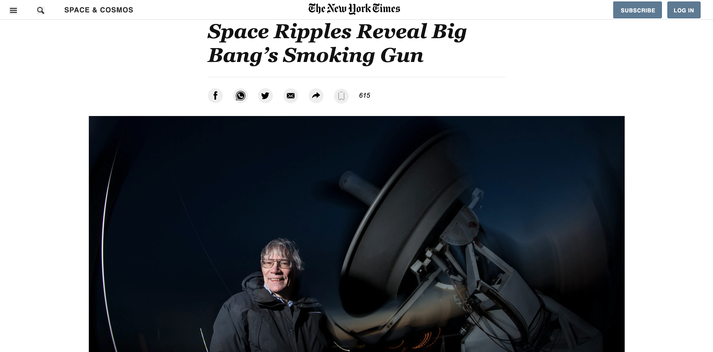

# Project 1 Positioning and FLoating Elements

> Week 1 project of Microverse.

This project is a clone of a New York Times article.

## Built With

- HTML
- CSS

## Live Demo

[Live Demo Link](https://memelopez.github.io/microV-wk1proj/)

## Getting Started

**it's easy.**

To get a local copy up and running follow these simple example steps.

### Prerequisites

### Setup

### Install

### Usage

### Run tests

### Deployment

## Authors

👤 **Elmer Lopez**

- GitHub: [@githubhandle](https://github.com/memelopez)
- Twitter: [@twitterhandle](https://www.linkedin.com/in/elmer-lopez-51b187200/)
- LinkedIn: [LinkedIn](https://twitter.com/memelopez10)

👤 **Junior Fondem**

- GitHub: [@githubhandle](GitHub.com/Fondem-Jr)
- Twitter: [@twitterhandle](https://twitter.com/twitterhandle)
- LinkedIn: [LinkedIn](https://linkedin.com/Fondem_Junior)

## 🤝 Contributing

Contributions, issues, and feature requests are welcome!

Feel free to check the [issues page](issues/).

## Show your support

Give a ⭐️ if you like this project!

## Acknowledgments

- Hat tip to anyone whose code was used
- Inspiration
- etc

## 📝 License

This project is [MIT](lic.url) licensed.
